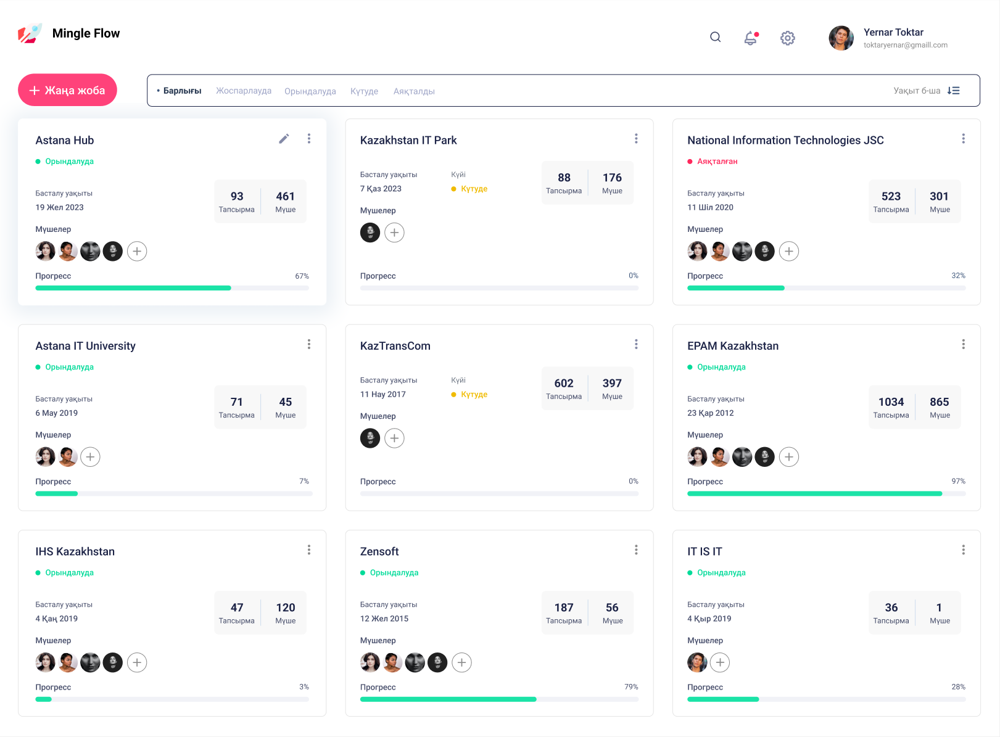

# MingleFlow 项目管理系统

> 2024 年 - KazATU 大学毕设

---

## 测试数据

用户名: Test User 1
邮箱: d1@a.a
密码: asd

## 技术栈

- 前端

  - `Node.js` 版本 16.20.0
  - `pnpm` 版本 8.3.1
  - `Nuxt3` 版本 3.6.2
  - `sass` for style

- 后端
  - `Python` 3.10.11
  - `Django` 3.2.8

---

## 截屏

